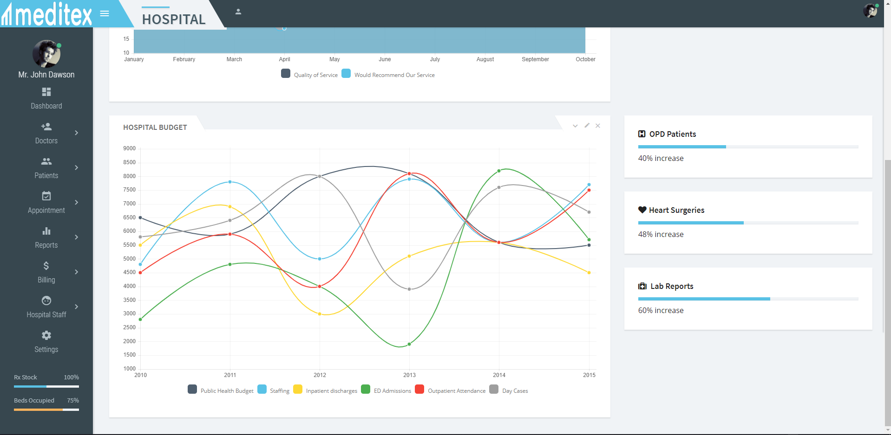

  <h1>MediTex Agularjs Hospital Admin</h1>

  <strong>MediTex Agularjs Hospital Admin Dashboard</strong>

  A headless, mobile responsive platform delivering ultra-fast, dynamic, personalized experiences. Beautiful admin dashboard, anywhere, on any device.

 

 

## Table of Contents

- [What makes MediTex special?](#what-makes-meditex)
- [Features](#features)
- [Installation](#installation)
- [Documentation](#documentation)
- [Demo](#demo)
- [Contributing](#contributing)
- [Translations](#translations)
- [Your feedback](#your-feedback)
- [License](#license)

## What makes MediTex special?

MediTex  is a Responsive Material Admin Dashboard and written with  Agularjs and Grunt.

## Features

- Responsive layout (desktops, tablets, mobile devices)
- Built with Bootstrap v4.3.1
- Clean and Material design
- Angularjs latest version
- HTML5 & CSS3
- SASS Support
- Login, register pages
- Calendar view
- Doctors
- Appointment Booking
- profile
- Patients
- Settings

## Installation

## Available Scripts

In the project directory, you can run:

### `npm start`

Runs the app in the development mode. 
Open [http://localhost:8080](http://localhost:8080) to view it in the browser.

The page will reload if you make edits. 
You will also see any lint errors in the console.

### `npm test`

Launches the test runner in the interactive watch mode. 
See the section about [running tests](https://docs.angularjs.org/guide) for more information.

### `npm run build`

Builds the app for production to the `build` folder. 
It correctly bundles React in production mode and optimizes the build for the best performance.

The build is minified and the filenames include the hashes. 
Your app is ready to be deployed!

See the section about [deployment](https://docs.angularjs.org/guide) for more information.

##File Structure
Slant/
├── Slant/                       ───> Contains the develop version of Slant Admin Template.
│   ├── app/                    └──> All application files in this folder.
│   │     ├── data/                       └──> All API data files.
│   │     ├── img/                        └──> All the logo, favicon images etc. 
│   │     ├── js/                          └──> All the custom scripts
│   │     ├── css/                        └──> All the custom stylesheets
│   │     ├── partials/                   └──> All the custom templates
│   │     ├── index.min.html
│   │     └── index.html
│   ├── bower_components                 └──> All bower dependencies
│   ├── grunt                               └──> All grunt task manager files
│   ├── bower.json
│   ├── Gruntfile.js
│   └── package.json
├── version.txt/                    ───> Contains the version of Slant Admin
└── documentation/                ───> The help documentation is.

## Documentation

To contribute, please see the (https://joysaha456.github.io/).

## MediTex

For PWA,MediTex go to the (https://github.com/joysaha456/meditex-angular-hostpital-admin) repository.

[View  demo](https://joysaha456.github.io/meditex-angular-hostpital-admin)

## Dashboard

For dashboard go to the (https://joysaha456.github.io/meditex-angular-hostpital-admin) repository.

[View dashboard demo](https://github.com/joysaha456/meditex-angular-hostpital-admin)

## Demo

Want to see MediTex in action?

[View ](https://joysaha456.github.io/meditex-angular-hostpital-admin)

## Contributing

We love your contributions and do our best to provide you with mentorship and support. If you are looking for an issue to tackle, take a look at issues labeled [`Help Wanted`](https://github.com/joysaha456/meditex-angular-hostpital-admin).

If nothing grabs your attention, check [our roadmap](https://github.com/joysaha456/meditex-angular-hostpital-admin) or come up with your feature. Just drop us a line or [open an issue](https://github.com/joysaha456/meditex-angular-hostpital-admin/issues/new) and we’ll work out how to handle it.

Get more details in our [Contributing Guide](https://github.com/joysaha456).

## Your feedback

Do you use MediTex as admin platform?
Fill out this short survey and help us grow. It will take just a minute, but mean a lot!

[Take a survey](https://github.com/joysaha456/meditex-angular-hostpital-admin)

## License

Disclaimer: Everything you see here is open and free to use as long as you comply with the [license](https://github.com/joysaha456/meditex-angular-hostpital-admin/blob/master/LICENSE). There are no hidden charges. We promise to do our best to fix bugs and improve the code.

Some situations do call for extra code; we can cover exotic use cases or build you a custom e-commerce appliance.

#### Crafted with ❤️ by (https://github.com/joysaha456)

#### Email :joysaha544@gmail.com